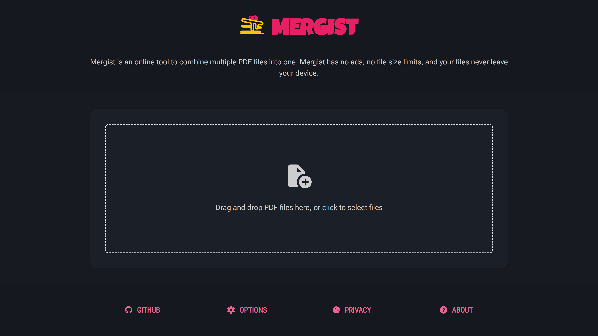
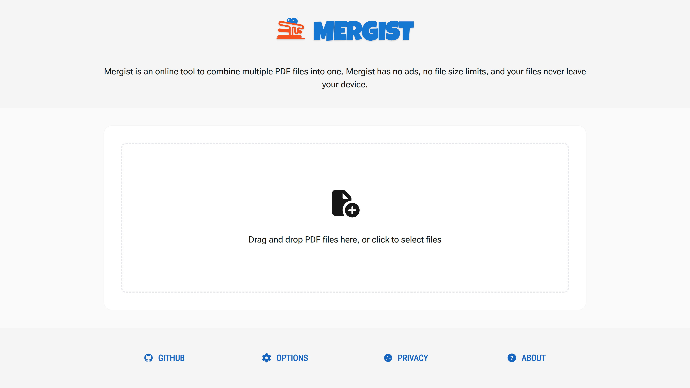
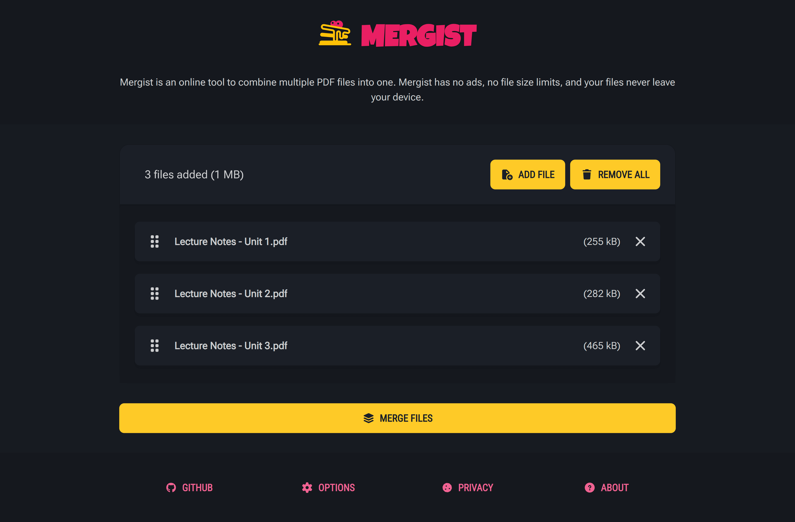
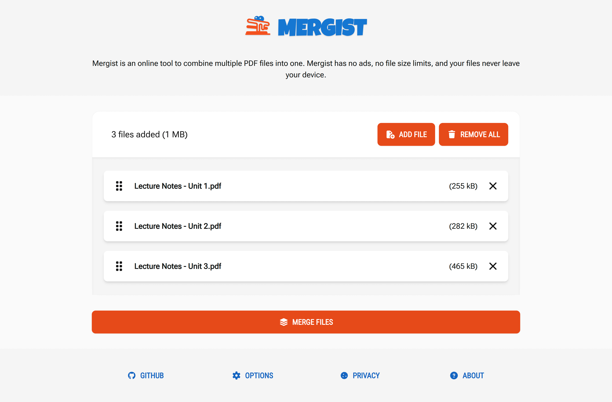
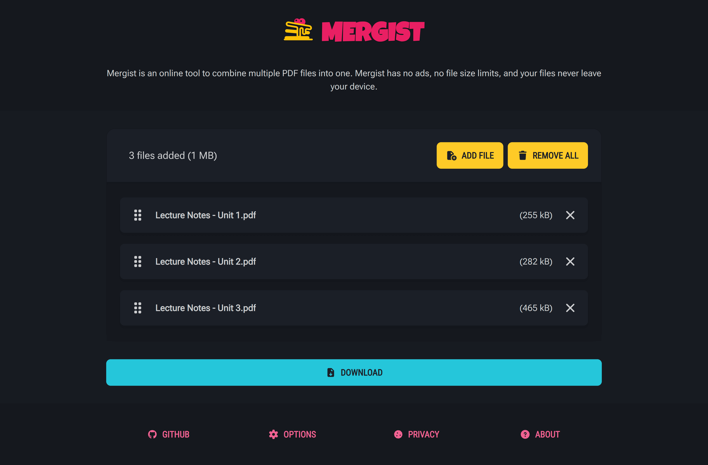
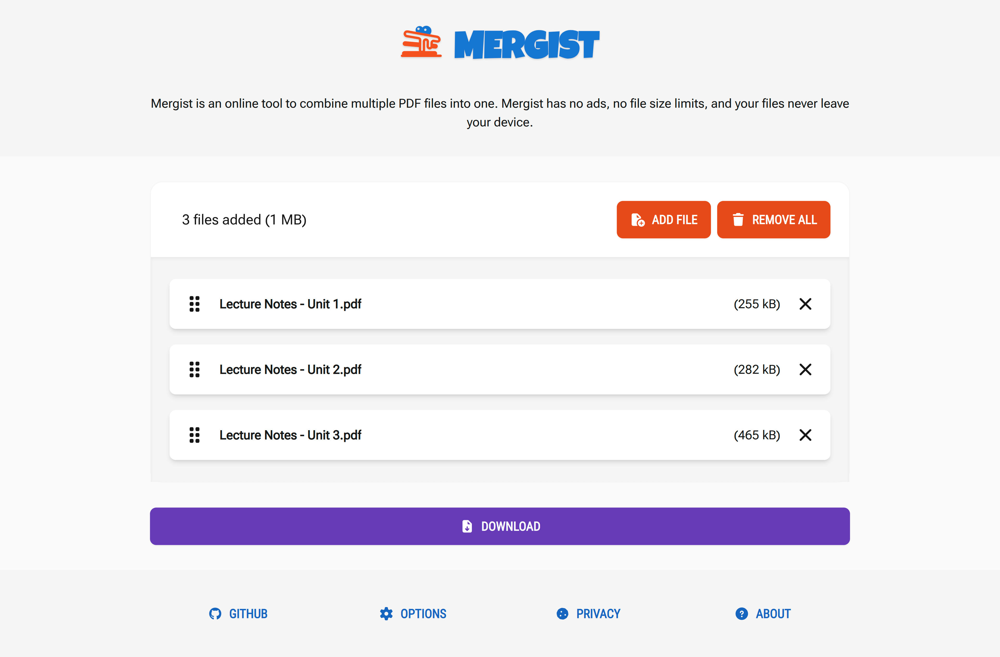
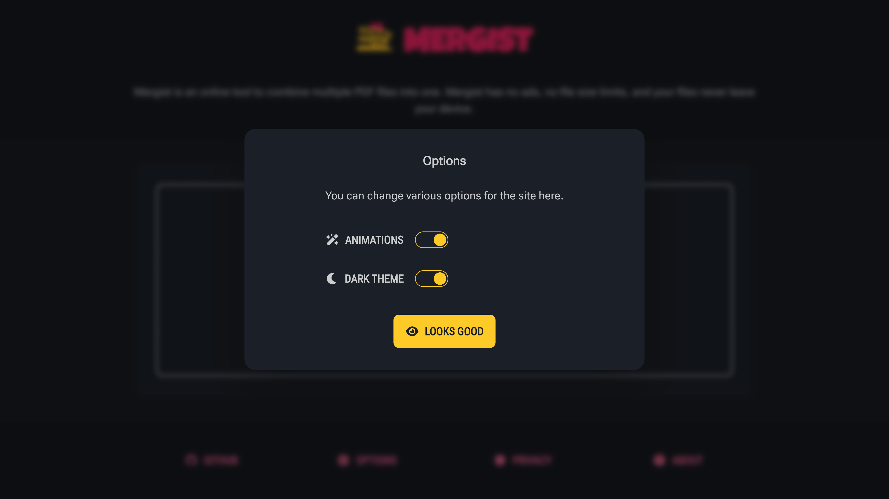
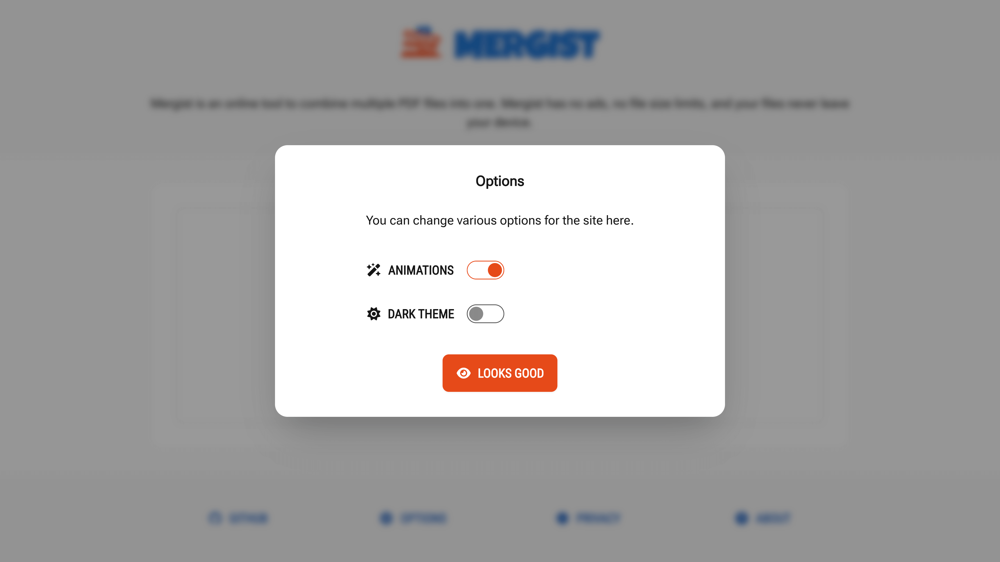

<!-- Project Header -->
<div align="center">
  <h1 class="projectName">
    <a href="https://mergist.johng.io" title="Mergist - Online PDF Merger">
      
    </a>
  </h1>
  <p class="projectBadges">
    
    
    
    <a href="LICENSE">
      
    </a>
		<a href="https://mergist.johng.io" title="Mergist - Online PDF Merger">
			
		</a>
  </p>
  <p class="projectDesc">
    Mergist is an online tool to combine multiple PDF files into one. Mergist has no ads, no file size limits, and your files never leave your device.
  </p>
  <br/>
</div>

## 👋 About

**Mergist** is a free online tool that lets you combine multiple PDF files into a single document instantly with **no ads, no file size limits, and no uploads to external servers**. The merging process runs locally on your device, so the merging process is _**fast**_, plus your files never leave your computer!

### Features

- **📄 Unlimited PDF merging:** Drag and drop or click to select multiple PDFs and merge them into one file
  - No limits on the amount of files that can be added
  - No limits on file sizes
- **↕️ Document reordering:** Click and drag to reorder documents
- **🔒 Privacy-focused:** All work happens in your browser, keeping your documents private and the process fast
- **🎛️ Customizable:** Switch between light and dark themes and toggle animations to suit your preferences
- **🆓 100% Free & Ad-Free:** Use the tool without distractions, privacy-invasive tracking, or paywalls — no ads, no sign-ups, no limitations
- **👨🏻‍💻 Open-source:** Know how to code? Help make **Mergist** better by contributing to the project on GitHub, or copy it and make your own version!

### Use Cases

- **📚 Students:** Combine lecture notes, assignments, and references into one PDF for submission
- **💼 Professionals:** Merge reports, contracts, and forms before sharing with clients or colleagues
- **📑 Administrators:** Assemble documentation packets or archives quickly without software installs
- **✉️ Everyday users:** Join scanned pages or downloaded PDFs for personal organization
- **🧪 Developers & testers:** Quickly merge sample files when preparing demos, specs, or docs

### Screenshots

|                    |                                                   **🌚 Dark**                                                    |                                                    **🌞 Light**                                                    |
| -----------------: | :--------------------------------------------------------------------------------------------------------------: | :----------------------------------------------------------------------------------------------------------------: |
|       **Homepage** |                               |                               |
|   **Adding files** |                       |                       |
| **Merge complete** |  |  |
|        **Options** |                  |                  |

### How it works

Here is an overview of how the app works:

1. When you select files to merge, they are read into memory and added to the reorderable list in the file manager
2. Clicking the `Merge Files` button triggers the merge process:
   1. We use the [PDF-LIB](https://pdf-lib.js.org/) library to create a new PDF document and append the pages from the input PDFs to it
   2. The resulting byte array is then converted to an object URL
   3. The `href` of the download link is set to the object URL so that you can download the merged PDF

## 📦 Installation

> [!NOTE]
> These instructions are for self-hosting **Mergist** on your own server or developing locally. If you just want to use the web app, you can visit it at [mergist.johng.io](https://mergist.johng,io).

1. **Install [Bun](https://bun.com/)** (we use Bun, but [npm](https://docs.npmjs.com/downloading-and-installing-node-js-and-npm) probably works too)

2. **Clone the repository**

   ```sh
   git clone https://github.com/twocaretcat/Mergist.git
   cd Mergist
   ```

3. **Install dependencies**

   ```sh
   bun install
   ```

4. **Build & Serve**

   ```sh
   bun run develop                 # Start the dev server, or
   bun run build && bun run serve  # Build for production & preview the build
   ```

## 🛟 Support

Need help? See the [support resources](https://github.com/twocaretcat/.github/blob/main/docs/SUPPORT.md) for information on how to:

- request features
- report bugs
- ask questions
- report security vulnerabilities

## 🤝 Contributing

Want to help out? Pull requests are welcome for:

- feature implementations
- bug fixes
- translations
- documentation
- tests

See the [contribution guide](../../contribute) for more details.

## 🧾 License

Copyright © 2025 [John Goodliff](https://johng.io/r/mergist) ([@twocaretcat](https://github.com/twocaretcat)).

This project is licensed under the AGPL-3.0 License. See the [license](LICENSE) for more details.

This project includes various resources which carry their own copyright notices and license terms. See [LICENSE-THIRD-PARTY.md](LICENSE-THIRD-PARTY.md) for more details.

## 🖇️ Related

### Recommended

Other projects you might like:

- **👤 [Tally](https://tally.johng.io/r/mergist)**: Your favorite dark mode word counter, now with even more themes! Count the number of characters, words, sentences, paragraphs, and lines in your text instantly with Tally
- **👤 [Shared File Finder for Google Drive](https://github.com/twocaretcat/Shared-File-Finder-for-Google-Drive)**: An Apps Script that finds all files/folders on Google Drive that are shared with others and adds them to a Google Sheet

## 💕 Funding

Find this project useful? [Sponsoring me](https://johng.io/funding) will help me cover costs and **_commit_** more time to open-source.

If you can't donate but still want to contribute, don't worry. There are many other ways to help out, like:

- 📢 reporting (submitting feature requests & bug reports)
- 👨‍💻 coding (implementing features & fixing bugs)
- 📝 writing (documenting & translating)
- 💬 spreading the word
- ⭐ starring the project

I appreciate the support!
